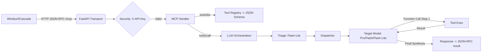

# GPT5Plan — Build Plan for MyGemini MCP Server 1.0

Version: 1.0
Date: 2025-09-27
Source Spec: `MyGemini MCP Server Specification 1.0.md`

## 1. Objectives and Scope

- **Primary Objective**: Build a high-performance, secure Python MCP Server acting as an LLM Gateway/Router for Windsurf Cascade, exposing MCP `tools/list` and `tools/call` via a single `/mcp` HTTP endpoint.
- **Scope**: Implement FastAPI-based ASGI transport, security (client API key via `X-API-Key`), MCP JSON-RPC 2.0 handling, Pydantic schema-driven tool definitions, Gemini model integration with routing (triage → dispatch → execution/fallback), and production-grade deployment (Docker + Uvicorn).
- **Out of Scope**: Full-featured user management UI, payment processing, or non-Gemini model providers in v1 (provide extension points).

## 2. Success Criteria

- **Protocol Compliance**: JSON-RPC 2.0 with non-null `id`; working `tools/list` and `tools/call` flows with schema-driven definitions.
- **Security**: All `/mcp` requests require a valid client API key in `X-API-Key`. Upstream `GEMINI_API_KEY` is only server-side.
- **Performance**: Async I/O under FastAPI/Uvicorn, target high concurrency; configurable timeouts per model; routing minimizes cost/latency.
- **Resilience**: Retries, per-model timeouts, fallback chain, basic circuit breaker.
- **Observability**: Structured logs, basic metrics, correlation by JSON-RPC `id`.
- **Deployability**: Reproducible Docker image; environment-configured runtime.

## 3. Architecture Summary

- **Transport Layer**: FastAPI (ASGI) + Uvicorn; single `/mcp` endpoint; optional SSE/streamable HTTP for streaming responses.
- **Security Layer**: FastAPI dependency with `fastapi.security.APIKeyHeader(name="X-API-Key")`; pluggable key validation backend.
- **MCP Handler Layer**: JSON-RPC parsing/validation; methods `tools/list` and `tools/call`.
- **LLM Orchestration Layer**:
  - **Triage Engine**: Gemini 2.5 Flash-Lite → classify intent to `RouteDecision` (Pydantic) with `task_type`, `model_preference`, `confidence_score`.
  - **Dynamic Dispatcher**: Routes to best model (Pro/Flash/Flash-Lite/2.0-Flash) by task + policy + health.
  - **Execution/Fallback Manager**: Performs request to model, handles function-calling 2-step workflow, with retries/timeouts/fallbacks.
- **Tool Execution Layer**: Pydantic-based tool definitions → JSON Schema for MCP and Gemini Function Declarations; async execution; structured outputs.
- **Config/Secrets**: Env-driven; `.env` allowed locally but gitignored; `GEMINI_API_KEY` required; client keys via secure store.



## 4. Work Breakdown Structure (WBS) and Milestones

### Phase 0 — Repository Scaffolding and Tooling

- **Project Skeleton**
  - `src/server/` (FastAPI app, routers, security, orchestration, tools)
  - `src/config/` (settings, env loading)
  - `src/clients/` (gemini client wrapper)
  - `src/models/` (pydantic models for JSON-RPC, schemas)
  - `tests/` (unit, integration)
- **Dependencies**
  - FastAPI, Uvicorn, Pydantic, `google-generativeai` (Gemini SDK), `httpx` (async), optional: `tenacity` (retries), `pybreaker` (circuit breaker), `python-dotenv` (dev only), logging libs.
- **Quality Gates**
  - Lint (ruff), format (black), type-check (mypy), unit test (pytest), pre-commit hooks.
- **Config**
  - `.gitignore` includes `.env` and any secret files.

### Phase 1 — Transport and Security

- **FastAPI App**
  - Create `app = FastAPI()` and a single `POST /mcp` route.
  - Optional: streaming endpoint variant for SSE.
- **API Key Auth**
  - `X-API-Key` via `APIKeyHeader(auto_error=False)`; dependency `verify_client_key`.
  - Pluggable key store: env list, file, or KMS adapter; mock for tests.
  - Return 401 on missing/invalid keys; propagate identity to request context.

### Phase 2 — MCP JSON-RPC 2.0 Core

- **Pydantic Models**
  - `JsonRpcRequest`, `JsonRpcResponse`, `ErrorObject` with `jsonrpc=="2.0"` and non-null `id`.
- **Method Routing**
  - Parse `method` ∈ {`tools/list`, `tools/call`}.
  - Validate `params` with Pydantic per method.
- **Error Handling**
  - Standard JSON-RPC errors for invalid request, method not found, parse error; map internal exceptions to `error` object.

### Phase 3 — Tool System and Registry

- **Tool Declaration**
  - Define each tool’s input/output as Pydantic models.
  - Registry exposes JSON Schema for `tools/list`.
  - Example baseline tools for v1:
    - `health_check` (no args) → returns service status.
    - `echo` (text) → returns same payload (useful for e2e tests).
- **Schema Generation**
  - Reuse Pydantic schema for both MCP and Gemini function declarations (single source of truth).

### Phase 4 — Gemini Integration and Routing

- **Client Wrapper**
  - Initialize Google Gemini client with `GEMINI_API_KEY`.
  - Support model IDs: `gemini-2.5-pro`, `gemini-2.5-flash`, `gemini-2.5-flash-lite`, `gemini-2.0-flash`.
  - Configurable per-model timeouts and request options; optional streaming.
- **Triage Engine**
  - Prompt Flash-Lite with system instruction to classify task.
  - Enforce `RouteDecision` Pydantic schema via structured output parsing.
- **Dispatcher**
  - Policy map from `task_type` to target model; allow overrides by config.
  - Health-aware selection (latency metrics, circuit status).
- **Execution & Fallback**
  - Execute request to target model with retries/timeout.
  - On failure/timeout: fallback chain Pro → Flash → Flash-Lite → 2.0-Flash.
  - Circuit breaker on repeated failures; cooldown window.

### Phase 5 — Function Calling Workflow

- **Two-Step Flow**
  - Step 1: Send user prompt + function declarations; capture model’s function-call decision JSON.
  - Step 2: Execute Python tool async; inject structured result back to model for final synthesis.
- **Structured Outputs**
  - Prefer Pydantic for tool results; include `content` (human summary) and `structuredContent` in JSON-RPC `result`.
- **Tool Runtime**
  - Async execution, time-limited; sanitize inputs; error wrapping.

### Phase 6 — Observability and Operations

- **Logging**
  - Structured JSON logs with correlation by JSON-RPC `id` and client key.
  - Log levels: request summary, routing decisions, retries/fallbacks, errors with stack traces.
- **Metrics**
  - Request counts, latency histograms per model, error rates, circuit states.
  - Optional: Prometheus exporter.
- **Tracing**
  - Optional OpenTelemetry spans across major steps.

### Phase 7 — Security, Rate Limiting, and Quotas

- **Rate Limiting**
  - Integrate Redis-backed limiter (e.g., `fastapi-limiter`) by client key.
- **Quotas**
  - Configurable per-key monthly/weekly caps; soft fail with 402/429 equivalents.
- **Audit**
  - Log client identity, tool usage, and token estimates for cost tracking.

### Phase 8 — Testing Strategy

- **Unit Tests**
  - JSON-RPC parsing/validation, auth dependency, schema generation, dispatcher policy logic.
- **Integration Tests**
  - `tools/list` and `tools/call` end-to-end with mocked Gemini responses.
  - Function-calling two-step with fake tool and fixed output.
- **Load/Soak Tests**
  - Locust/k6 scenarios for concurrent `tools/call` on simple tasks; measure timeouts/fallback behavior.

### Phase 9 — Deployment and DevOps

- **Containerization**
  - Multi-stage Dockerfile; run with Uvicorn workers; env-configured ports/keys.
- **Environments**
  - Dev/stage/prod with separate client key stores and quotas.
- **CI/CD**
  - GitHub Actions: lint, type-check, test, build image, push to registry; optional deploy.
- **Runtime Configuration**
  - `GEMINI_API_KEY` (required); client key backend configuration; per-model timeouts; toggles for streaming and tracing.

## 5. Detailed Implementation Plan

### 5.1 Directory Structure (Proposed)

```
mygemini-mcp/
  src/
    server/
      __init__.py
      app.py                 # FastAPI app + /mcp route
      security.py            # X-API-Key validation
      mcp_handler.py         # JSON-RPC parsing and dispatch
      tools/
        __init__.py
        registry.py          # Tool registry + schemas
        health.py
        echo.py
      orchestration/
        __init__.py
        triage.py            # Flash-Lite triage
        dispatcher.py        # Routing policy + fallbacks
        executor.py          # Execution, retries, circuit breaker
    clients/
      __init__.py
      gemini.py              # Gemini SDK wrapper
    models/
      __init__.py
      jsonrpc.py             # Request/Response/Error Pydantic models
      schemas.py             # RouteDecision, tool IO models
    config/
      __init__.py
      settings.py            # Env-based settings
  tests/
    unit/
    integration/
  Dockerfile
  requirements.txt (or pyproject.toml)
  .env.example
  README.md
```

### 5.2 Configuration and Secrets

- **Environment Variables**
  - `GEMINI_API_KEY`: required, server-side only.
  - `ALLOWED_CLIENT_KEYS`: comma-separated (dev) or pointer to secret backend.
  - `MODEL_TIMEOUTS`: JSON map or separate envs per model (e.g., `PRO_TIMEOUT=60`).
  - `RATE_LIMIT_PER_MINUTE`: optional.
- **Local Dev**
  - Support `.env` via `python-dotenv` but ensure `.gitignore` excludes it.

### 5.3 Security Dependency

- Implement `verify_client_key()` using `APIKeyHeader(name="X-API-Key", auto_error=False)`.
- Lookup backends: in-memory set (dev), file-backed, or KMS adaptor interface for prod.

### 5.4 JSON-RPC Models and Validation

- Enforce `jsonrpc == "2.0"` and non-null `id` (str|int).
- Map exceptions to JSON-RPC error codes; always respond with either `result` or `error`.

### 5.5 Tool Registry and Schemas

- Decorator or registry pattern to register tools with:
  - `name`, `description`, `input_model`, `output_model`, `handler` (async callable).
- `tools/list` builds response from Pydantic-generated JSON Schemas.

### 5.6 Triage and Routing

- `RouteDecision` Pydantic with fields: `task_type`, `model_preference`, `confidence_score`.
- Triage prompt templates for consistent classification.
- Dispatcher policy mapping examples:
  - `CODE_GEN` → `gemini-2.5-pro`
  - `COMPLEX_ANALYSIS` → `gemini-2.5-pro`
  - `SIMPLE_QUERY` → `gemini-2.5-flash-lite`
  - Fallback order: Pro → Flash → Flash-Lite → 2.0-Flash

### 5.7 Function Calling Orchestration

- Step 1: Model returns `{ function_name, arguments }` as JSON.
- Execute mapped tool asynchronously; capture output as Pydantic.
- Step 2: Send tool result back to model for final synthesis; return `content` and `structuredContent` in JSON-RPC `result`.

### 5.8 Resilience Features

- **Timeouts** per model (e.g., Pro=60s, Flash=20s, Flash-Lite=10s).
- **Retries** with backoff for transient errors; cap attempts.
- **Circuit Breaker** using `pybreaker` or custom: open on N failures; half-open after cooldown.

### 5.9 Observability

- Log router decisions with `task_type`, selected model, latency, retries, fallbacks.
- Correlate logs with JSON-RPC `id` and client key hash.
- Optional Prometheus metrics for QPS/latency/errors per model.

### 5.10 Testing Plan

- Unit: Pydantic models, tool registry, security dependency, dispatcher logic.
- Integration: End-to-end `tools/list`/`tools/call` flows with mocked Gemini.
- Load: Concurrency tests for `tools/call` with simple echo tool.

## 6. Timeline and Estimates (Rough)

- **Week 1**: Phases 0–2 (scaffold, transport/security, JSON-RPC core, baseline tools).
- **Week 2**: Phases 3–5 (Gemini routing, function-calling, resilience) + tests.
- **Week 3**: Phases 6–9 (observability, rate limiting, Docker, CI/CD, docs) + perf tuning.

## 7. Risks and Mitigations

- **Gemini API changes or quotas**: Abstract via client wrapper; configurable model IDs; alert on quota errors.
- **Streaming complexity**: Start non-streaming; add SSE later behind a flag.
- **Cost overrun**: Enforce per-key rate limits/quotas; triage defaults to Flash-Lite; audit logs.
- **Security leakage**: Strict env-based secrets; never return upstream key; pentest headers and error messages.

## 8. Acceptance Criteria

- `POST /mcp` supports `tools/list` returning accurate JSON Schemas for all tools.
- `POST /mcp` supports `tools/call` end-to-end including two-step function-calling for at least one example tool.
- Auth enforced via `X-API-Key`; unauthorized returns 401.
- Triage routes tasks appropriately; fallback executes on upstream failure; circuit breaker opens on repeated failures.
- Container builds and runs with env-configured keys and timeouts.

## 9. Deliverables

- Source code in structured layout with tests and docs.
- `Dockerfile` and runbook for environment setup.
- `README.md` with usage, configuration, and Windsurf client integration instructions.
- Basic CI pipeline configuration.

## 10. Open Questions

- Preferred rate limiting backend (Redis vs. in-process)?
- Required minimum tool set beyond `health_check` and `echo`?
- Is SSE streaming required in v1, or acceptable as v1.1?
- Any org-specific key management (KMS) we should integrate with initially?
